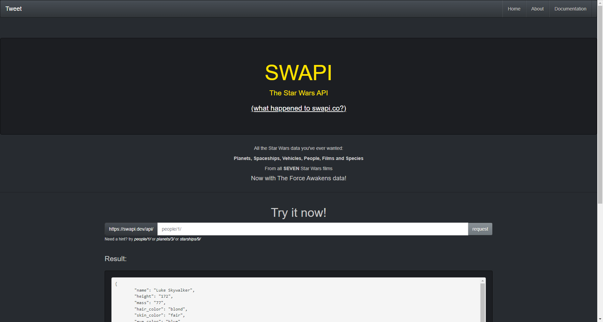

## Проект по автоматизации тестирования The Star Wars API
___
### Содержание
- [Исходные данные](#item-1)
- [Цель проекта](#item-2)
- [Используемые технологии](#item-3)

[//]: # (- [API тесты]&#40;#item-4&#41;)

[//]: # (- [Сборка проекта и запуск тестов]&#40;#item-5&#41;)

[//]: # (- [Отчет о прохождении тестов]&#40;#item-6&#41;)

[//]: # (- [Уведомление о прохождении тестов]&#40;#item-7&#41;)

[//]: # (- [Видео о прохождении тестов]&#40;#item-8&#41;)

___

### Исходные данные

[Cайт SWAPI](https://swapi.dev/)

___

### Цель проекта

Тестирование **The Star Wars API** согласно [документации](https://swapi.dev/documentation#json), изложенной на сайте проекта. 

___

### Используемые технологии

<table width="100%" border='0'>
  <tbody>
    <tr>
      <td>Язык программирования, IDE</td>
      <td align="center">
        
        
      </td>
    </tr>
    <tr>
      <td>Библиотеки, фреймворки для написания тестов</td>
      <td align="center">
        
      </td>
    </tr>
    <tr>
      <td>
        Запуск тестов
      </td>
      <td>
        
        
      </td>
    </tr>
    <tr>
      <td>
        Формирование отчета и отправление уведомлений
      </td>
      <td>
        
        
      </td>
    </tr>
  </tbody>
</table>

[//]: # (___)

[//]: # ()

[//]: # (### API тесты)

[//]: # ()
[//]: # ()
[//]: # ()
[//]: # (___)

[//]: # ()

[//]: # (### Сборка проекта и запуск тестов)

[//]: # ()
[//]: # ()
[//]: # ()
[//]: # (___)

[//]: # ()

[//]: # (### Отчет о прохождении тестов)

[//]: # ()
[//]: # ()
[//]: # ()
[//]: # ()
[//]: # (___)

[//]: # ()

[//]: # (### Уведомление о прохождении тестов)

[//]: # (___)

[//]: # ()

[//]: # (### Видео о прохождении тестов)